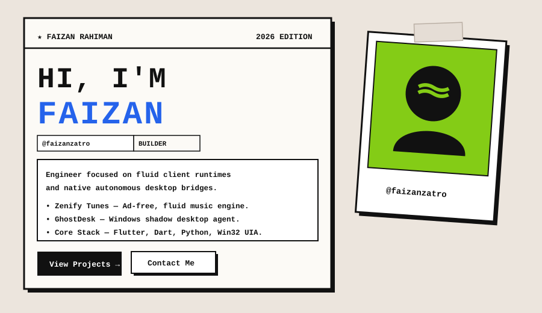

<div align="center">



<br/>

<!-- Solid 2D Flat Badges -->
<p align="center">
  <a href="https://zenifytune.com">
    
  </a>
  &nbsp;
  <a href="https://x.com/FaizanRahiman">
    
  </a>
  &nbsp;
  <a href="https://linkedin.com/in/faizanrahiman">
    
  </a>
  &nbsp;
  <a href="mailto:faizanrahimanhp@gmail.com">
    
  </a>
</p>

</div>

---

### 🗂️ Active Projects

<table>
  <tr>
    <td width="50%" valign="top">
      <h3>🎵 Zenify Tunes</h3>
      <p><em>Modern, Ad-Free Audio Streaming Client</em></p>
      <p>High-performance music streaming app crafted with Flutter and Python. Features gesture-driven glassmorphism, instant local audio caching, and zero tracking.</p>
      <code>Flutter</code> • <code>Dart</code> • <code>Python</code> • <code>AudioEngine</code>
    </td>
    <td width="50%" valign="top">
      <h3>🖥️ GhostDesk</h3>
      <p><em>Shadow-Desktop Automation Engine for Windows</em></p>
      <p>Background Win32 desktop isolator. Enables AI agents to control Windows applications autonomously without hijacking your physical mouse cursor.</p>
      <code>Python</code> • <code>Win32 API</code> • <code>MCP</code> • <code>UIA</code>
    </td>
  </tr>
</table>

---

### 🧰 Tech Stack Matrix

```ini
[MOBILE & UI]     Flutter · Dart · Material 3 · Glassmorphism · AudioSession
[AGENT & BACKEND] Python 3.12 · Win32 Subsystem · Accessibility UIA · FastMCP · Ollama
[INFRA & SYSTEMS] Cloudflare Routing · Git Engine · Windows Subsystem · Docker
